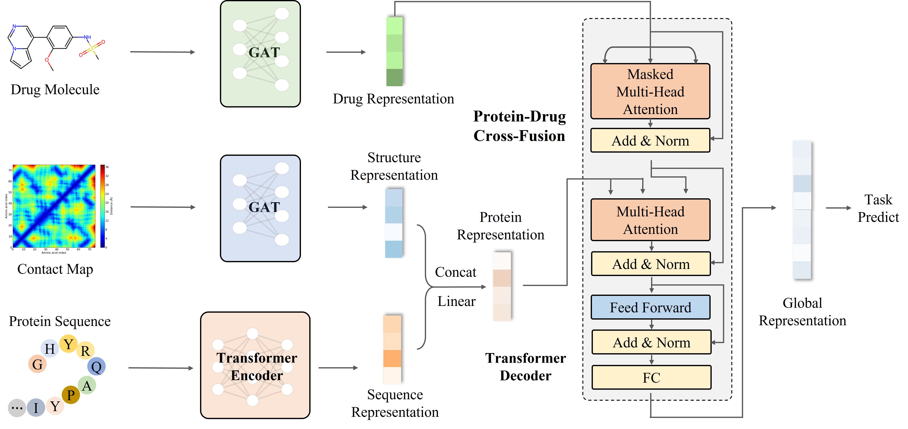
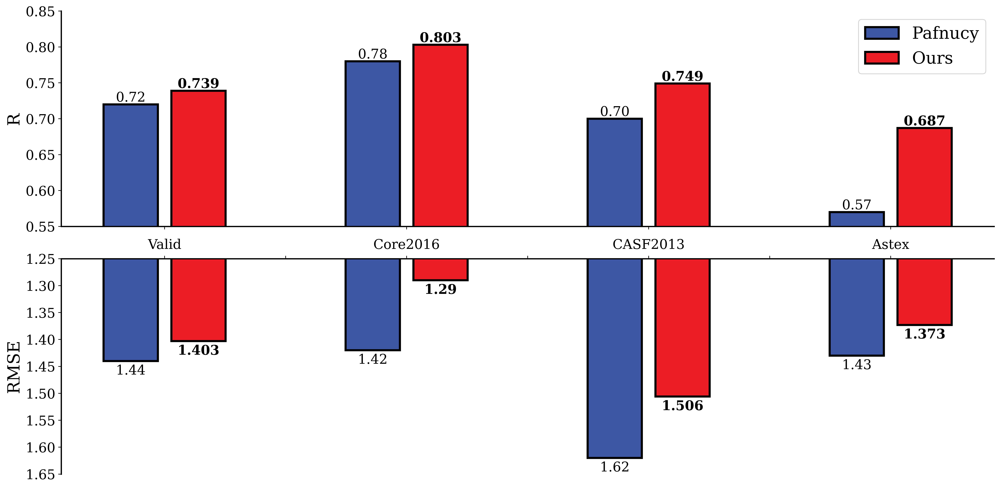

# Accurate Protein-Drug Interaction Prediction Via Attention Network With Structure Information

A novel deep model for estimating the binding affinity between proteins and drugs, with both the sequence and structure information of proteins taken into account to interact with drugs.

## Table of Contents

- [Accurate Protein-Drug Interaction Prediction Via Attention Network With Structure Information](#accurate-protein-drug-interaction-prediction-via-attention-network-with-structure-information)
  - [Table of Contents](#table-of-contents)
  - [Model Architecture](#model-architecture)
  - [Environment & Dependencies](#environment--dependencies)
  - [Usage](#usage)
  - [Performance](#performance)
  - [Citation](#citation)


## Model Architecture



## Environment & Dependencies

* `Python`==3.8.13

* `torch`==1.8.0

```bash
# creat new environ
conda creat -n pdi_fusionner python=3.8.13

# build dependencies
pip install -r requirements.txt
pip install torch==1.8.0+cu111 torchvision==0.9.0+cu111 torchaudio==0.8.0 -f https://download.pytorch.org/whl/torch_stable.html
```

## Usage

1. Data preparation

* Place the processed data file, namely `pafnucy_total_rdkit-smiles-v1.csv`,  to `./files/data`. Notice that this file combines both the proteins' datasets, i.e., PDBBind, CASF-2013 and Astex datasets, and the drug SMILES dataset. An entry of this data should look like:
   
   |     | PDB-ID | seq        | SMILES     | rdkit_smiles | Affinity-Value | set   |
   |:---:| ------ | ---------- | ---------- | ------------ | -------------- | ----- |
   | 0   | 11gs   | PYTVVYF... | CCC(=O)... | CC[C@@H]...  | 5.82           | train |

* Place the protein contact map that processed from 3D crystal structure data, namely `pdbbind_2016`, to `./files/3d_pdb`

* Update the configurations `config.yaml` to make sure everything is matched
   
   

2. Fine-tuning
   
```python
python finetune_main.py --model_idx=0 --epochs=150 --gpu_start=0 --batch_size=64 --tb
```

Specify `model_idx` to choose the model we proposed or its ablation variants. More options please refer to `config.yaml` and the argument parser in `finetune_main.py`. \
Notice: our pre-trained encoder is at `./files/pretrain/BertModel.pth`.

## Performance



## Citation

Please cite the following paper if you found our model useful. Thanks!

> Accurate Protein-Drug Interaction Prediction Via Attention Network With Structure Information.

```
@{
 title = {Accurate Protein-Drug Interaction Prediction Via Attention Network With Structure Information},
 year = {2022}
}
```
